# ProofChain

Blockchain-anchored framework for verifiable document provenance and AI-assisted tamper
localization of text-based PDFs. It answers four questions about a document: *did it change,
where, was the change authorized, and what kind of change was it?*

- **Crypto decides, AI explains.** The verdict comes from hashes, a Merkle tree and the on-chain
  record. The NLP layer only labels and explains the changes it finds; it never alters a verdict.
- **Documents never go on-chain.** The chain stores only the document id, file hash, text Merkle
  root, previous root, canonicalization version and a timestamp.
- **Only approved revisions are anchored**, and the submitter (maker) cannot be the approver (checker).



**Stack:** FastAPI (Python 3.11) · MongoDB · S3 (MinIO locally) · Solidity/Hardhat (local node, Sepolia
optional) · React + TypeScript + Vite · spaCy / sentence-transformers.

## Quick start (Windows + PowerShell)

Prerequisites: Windows 10/11, **Docker Desktop (running)**, Python 3.11, Node 20, Git, and about
10 GB of free disk.

```powershell
git clone https://github.com/mohamed-faizal007/proofchain.git
cd proofchain\backend
py -3.11 -m venv .venv
.\.venv\Scripts\Activate.ps1
pip install -e ".[dev,eval]"
cd ..
.\scripts\demo.ps1
```

`demo.ps1` starts MongoDB, MinIO, a local Hardhat chain, the backend and the frontend, deploys the
`ProofChainRegistry` contract, seeds demo users, registers a lease, gets two versions approved and
anchored, then verifies the original, the amendment, four tampered copies and a re-saved copy and prints
the verdicts. It is safe to rerun.

When it finishes:

| What | Where |
|---|---|
| App | http://127.0.0.1:8080 |
| API docs | http://127.0.0.1:8000/docs |
| Logins | `issuer@proofchain.local`, `approver@proofchain.local`, `admin@proofchain.local` |
| Password | `$env:SEED_PASSWORD` if set, otherwise the public dev default printed by the script |

The generated test PDFs are in `demo/data`. Upload them on the **Verify** page to see the verdicts.

### The first Docker build is large (read this first)

The backend image bakes in spaCy, a sentence-embedding model and CPU PyTorch: **about 4.4 GB**. On a
fresh clone the first `demo.ps1` run builds it, which takes **about 15 to 30 minutes, longer on a slow
link** (measured: 14 min 39 s), and needs a stable connection (a dropped pip download fails the build;
rerun to retry). Later runs reuse the image. Ports 27017, 8000, 8080, 8545, 9000 and 9001 must be free.

- `.\scripts\demo.ps1 -Build` rebuilds the images after code changes (opt-in on purpose).
- `.\scripts\demo.ps1 -Reset` wipes the demo database and object store (use it after the chain container is recreated).
- `docker build --build-arg WITH_NLP=0 ...` gives a slim, rule-only image (no `PARTY_CHANGE`
  detection, no embeddings).
- `.\scripts\demo.ps1 -Network sepolia` targets the Sepolia testnet (needs a funded key; not covered by the project tests).

## Using it

- [User guide](docs/USER_GUIDE.md): issuer, approver and verifier workflows and how to read a verdict.
- [API examples](docs/API_EXAMPLES.md): request and response samples captured from a running stack.
- [Project explained](docs/PROJECT_EXPLAINED.md): how the hashing, Merkle tree, contract, NLP layer and evaluation work.

## Repository layout

```
backend/     FastAPI app (app/) + pure integrity library (proofchain_core/) + tests/
contracts/   Hardhat + Solidity (ProofChainRegistry)
frontend/    React + TypeScript + Vite + Tailwind
eval/        Tamper-corpus generator and evaluation harness (produces the report results)
infra/       docker-compose (MongoDB, MinIO, Hardhat node, backend, frontend)
scripts/     demo.ps1, secret_scan.py and helpers
docs/        Specs (00-09), ADRs, project report, guides
```

Specs live in `docs/` (`02_ALGORITHMS.md` is normative; decisions are in `09_DECISIONS.md`).
`PROGRESS.md` is the development log and `TASKS.md` the backlog.

## Development and tests

```powershell
cd backend;   python -m pytest -q                       # backend + core
cd backend;   python -m ruff check .; python -m mypy proofchain_core app
cd contracts; npm ci; npx hardhat test                  # smart contract
cd frontend;  npm ci; npm run lint; npm run test        # frontend
python scripts\secret_scan.py                           # from the repo root
```

The evaluation (`eval/`) and the real-model NLP tests are described in `docs/08_TESTING_AND_EVAL.md`.
CI runs these on every push.

## Known limitations

Full list in [docs/PROJECT_EXPLAINED.md](docs/PROJECT_EXPLAINED.md) section 15 and `PROGRESS.md`.

- **Scope:** text-based English PDFs only; scanned PDFs are rejected. Single organisation, no mainnet, no PAdES.
- **Unanchored approvals:** an approved revision still waiting for its anchor is reported authentic with
  the chain check skipped; an unreachable node also skips the check instead of failing.
- **Pagination is part of the text root:** re-paginating the same text counts as a change.
- **Classification:** CLAUSE_MODIFIED recall is 0.571 and the evaluation corpus is synthetic.
- **Operations:** rate limits are per client address, in memory and keyed on the TCP peer (not
  proxy-aware); no account lockout; one backend anchor wallet; the JWT is kept in `localStorage`.
- **Not implemented:** `/chain/status` (in the API spec), the 12 MB tree-to-S3 fallback, and any web UI for revoking a revision or retrying a failed anchor (both are API-only: `POST /revisions/{id}/revoke` and `/retry-anchor`). New revisions can be submitted from the document page (*Submit new revision*, document owner only) or through the API.
- **Demo caveats:** the Sepolia path of `demo.ps1` was not exercised by the tests; the `app` Docker
  profile has no reverse proxy, and `/health` reports `nlp` as a static `not_configured`.

Team: Ekanath (23MIA1023) · Mohamed Faizal (23MIA1133) · Rohan Julius Preetan (23MIA1160)
