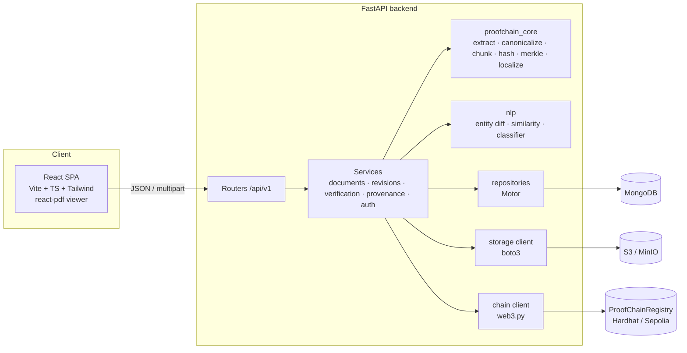
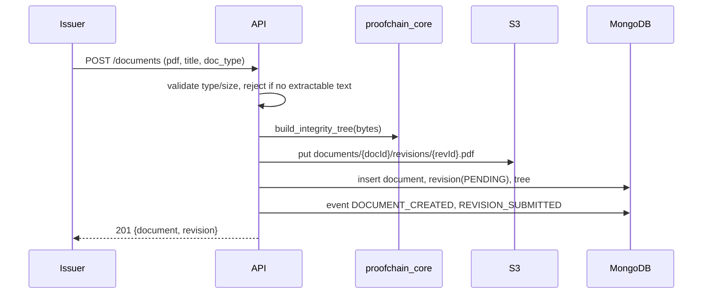
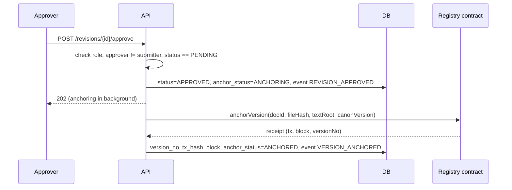
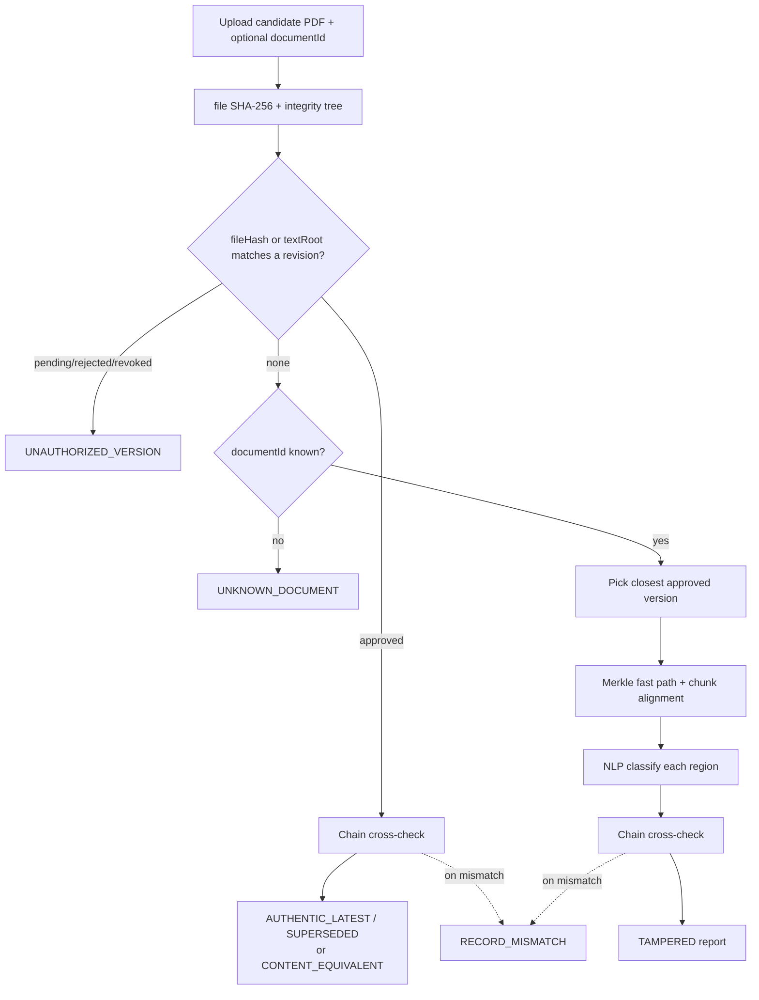

# 01 — Architecture

## 1. Component view


**Layering rule:** routers → services → (core | nlp | repositories | storage | chain). Nothing below
services imports from services. `proofchain_core` imports nothing from the app.

## 2. Backend package layout
```
backend/
  pyproject.toml
  proofchain_core/            # pure, deterministic, fully unit-tested
    __init__.py               # exports CANON_VERSION, build_integrity_tree, localize
    types.py                  # dataclasses: Chunk, Page, Section, IntegrityTree, ChangeRegion, LocalizationResult
    extract.py                # PyMuPDF -> raw blocks (text, bbox, font info) per page
    canonical.py              # normalize_text()
    chunking.py               # blocks -> chunks
    sections.py               # heading detection -> sections overlay
    hashing.py                # sha256 helpers, leaf/node hashing with domain separation
    merkle.py                 # root, proof, verify_proof, level structure
    tree.py                   # build_integrity_tree(pdf_bytes) -> IntegrityTree
    localize.py               # compare two trees -> LocalizationResult
  app/
    main.py  config.py  errors.py  deps.py  logging.py
    api/v1/   auth.py documents.py revisions.py verify.py provenance.py health.py
    services/ auth_service.py document_service.py revision_service.py
              anchoring_service.py verification_service.py provenance_service.py
    repositories/ users.py documents.py revisions.py trees.py events.py verifications.py
    models/   (Pydantic v2 schemas: db models + request/response DTOs)
    storage/  s3.py
    chain/    registry_client.py  abi/ProofChainRegistry.json
    nlp/      entities.py similarity.py classifier.py explain.py
    security/ passwords.py jwt.py
  tests/ unit/core  unit/app  integration  fixtures/
```

## 3. Key flows

### 3.1 Register document (revision 1)


### 3.2 Approve & anchor

On failure: `anchor_status=FAILED`, event `ANCHOR_FAILED`; an admin endpoint and a startup
reconciler retry FAILED/stuck ANCHORING revisions (idempotent: check chain first).

### 3.3 Verify


## 4. Storage responsibilities (report §1.3)
| Store | Holds |
|---|---|
| S3 / MinIO | Original PDF of every revision (`documents/{docId}/revisions/{revId}.pdf`), bucket versioning on |
| MongoDB | users, documents, revisions, integrity trees, provenance events, verification reports |
| Blockchain | per approved version: fileHash, textRoot, prevTextRoot, canonVersion, timestamp; revocations |
Candidate PDFs uploaded for verification are **not** persisted by default (only their hashes and the report).

## 5. Configuration
All settings via environment (`app/config.py`, pydantic-settings) — see `.env.example`.
`APP_ENV=test` swaps in: mongomock-motor or a test DB, moto-backed S3, an in-memory fake chain client,
and a stub NLP classifier, so unit/integration tests need no Docker.

## 6. Cross-cutting
- Logging: structured JSON logs with request id.
- Errors: single envelope `{ "error": { "code", "message", "details" } }`.
- Time: all timestamps UTC ISO-8601; on-chain uses block timestamp.
- IDs: `document_id`, `revision_id` are UUID4 strings; on-chain `docId = sha256(document_id utf-8)` as bytes32.
