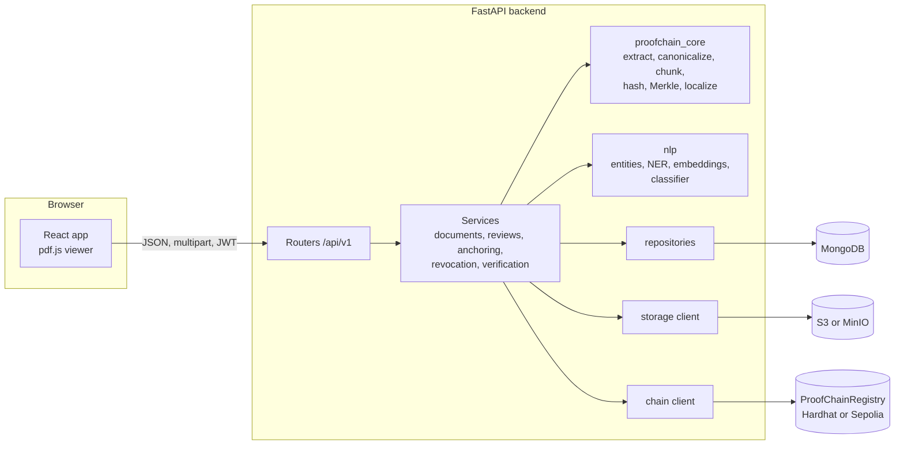

# ProofChain, explained

A presenter's guide to what ProofChain is, how it works and what the evidence says. Every statement comes from the repository (code, `docs/`, ADRs, `PROGRESS.md`, `eval/`). Where the code and the spec disagree, the text says **[spec differs]**. Anything that could not be checked is marked **not verified**.

Hash values in the examples are real, shortened to the first 8 to 12 hex characters. They were computed by running `proofchain_core` on the demo PDFs in `demo/data/` (regenerated deterministically by `scripts/demo.ps1`). A different PyMuPDF, reportlab or Faker version could change the PDF bytes and therefore the values; the structure of the examples would stay the same.

---

## 1. The problem and the idea

**The problem.** A PDF contract, certificate or invoice gets emailed, copied and re-saved. Later someone asks four questions:

1. Is this file the same as the original?
2. If not, *where* did it change?
3. Was the changed version actually approved by someone with authority?
4. What *kind* of change was it: a changed amount, a swapped name, a weakened obligation?

A single hash of the file answers only the first question, and only as "yes/no". ProofChain answers all four.

**Who uses it.** The system has four roles (`backend/app/models/user.py`):

| Role | Does |
|---|---|
| ISSUER (maker) | Registers documents, submits new versions |
| APPROVER (checker) | Approves or rejects versions submitted by *someone else*; can revoke an approved version |
| VERIFIER | Verifies files and reads reports |
| ADMIN | Manages roles; retries failed anchoring |

Anyone, without logging in, can upload a PDF and get a verdict (config `PUBLIC_VERIFY`, default on), but the anonymous report is redacted (section 9).

**The core principle, in four short sentences.**

- **Cryptography decides the verdict.** Hash comparisons and the blockchain record produce `AUTHENTIC`, `TAMPERED` and so on.
- **AI only explains.** The language model code runs *after* the verdict is fixed, and its output cannot change it (ADR-008; verdict code in `services/verdict.py` never reads NLP output).
- **Documents never go on-chain.** The PDF stays in object storage.
- **Only fingerprints go on-chain.** A few 32-byte hashes, a version number and a timestamp per approved version.

---

## 2. Tech stack

Versions are exact only where the repository pins them. Elsewhere the repository gives a range (for example `>=0.110`) and the table says so.

| Technology | Role in ProofChain | Why this one (source) |
|---|---|---|
| **Python 3.11** | Backend and the integrity library | Project standard (`CLAUDE.md`); `requires-python >=3.11` |
| **FastAPI** (`>=0.110`) + Uvicorn | REST API, `/api/v1` | Async I/O, Pydantic validation, auto-generated OpenAPI at `/docs` |
| **Pydantic v2** (`>=2.6`) | Data models, settings | Typed models for requests and DB documents |
| **MongoDB 7** (`mongo:7`) via **Motor** | Users, documents, revisions, trees, events, reports | Document-shaped data; Motor is async. ADR-009: explicit repositories, no ODM, so tests can use fakes |
| **S3 / MinIO** (`boto3`; MinIO release `RELEASE.2025-09-07T16-13-09Z`) | Stores the PDF files | ADR-002: same code against MinIO locally and AWS S3 in production; bucket versioning on |
| **Solidity 0.8.24**, optimizer on (200 runs) | The `ProofChainRegistry` contract | Mainstream smart-contract language; exact version pinned |
| **OpenZeppelin Contracts** (`^5.0.2`) | `AccessControl` for the anchor role | Audited access-control code instead of hand-written |
| **Hardhat** (`^2.22.0`) | Compile, test, deploy; local chain | Local node is free and instant for development (ADR-011) |
| **Sepolia** (chain id 11155111) | Public test network for the demo | Free test ETH, public block explorer (ADR-011). Mainnet is out of scope (PRD) |
| **web3.py** (`>=6.15`, `AsyncWeb3`) | Backend talks to the contract | Python backend, so a Python client |
| **PyMuPDF 1.28.2** (pinned) | PDF text extraction with positions and fonts | ADR-015: fast, gives bounding boxes and font info for sections and highlights. AGPL licence noted (acceptable for academic use) |
| **bcrypt**, **PyJWT** | Password hashing, access tokens | ADR-014: HS256 JWT with role claims, single-organisation scope |
| **spaCy 3.8.16** + `en_core_web_sm` | Named-entity recognition (people, organisations) | Pinned in `eval/nlp-pins.txt`; model pinned by wheel URL and sha256 in the CI workflow |
| **sentence-transformers 6.1.0** + `all-MiniLM-L6-v2` | Sentence embeddings, cosine similarity | Pinned in `eval/nlp-pins.txt`; model pinned by Hugging Face commit |
| **dateparser** (`>=1.2`) | Normalises dates in changed clauses | `06_NLP_SPEC.md`: dates normalised, day-month-year preferred |
| **torch 2.14.0** (CPU) | Needed by sentence-transformers | Pinned in `eval/nlp-pins.txt` |
| **React 18.3, TypeScript ~5.6, Vite 6** | Web interface | Strict-mode TypeScript (`CLAUDE.md`) |
| **Tailwind CSS 3.4** | Styling | Utility classes, theme tokens in `tailwind.config.ts` |
| **pdf.js** (`pdfjs-dist ^5.6`) | Renders PDFs in the browser with highlight overlays | Called directly (no `react-pdf` wrapper); the frontend has no icon library, only Unicode glyphs and one inline SVG |
| **TanStack Query, axios, react-hook-form, zod, react-router** | Data fetching, forms, validation, routing | Versions are caret ranges in `package.json` |
| **Docker / Compose** | MongoDB, MinIO, Hardhat node, and (profile `app`) backend and frontend | One command starts the stack. Ports bind to `127.0.0.1` only |
| **nginx** (`nginx-unprivileged:1.27-alpine`) | Serves the built frontend | Static files, SPA fallback, non-root |
| **GitHub Actions** | CI: backend lint, types, tests; contract tests; frontend lint, tests, build; Windows determinism job; secret scan; scheduled NLP evaluation | `.github/workflows/ci.yml`, `eval-nlp.yml` |
| **pytest, hypothesis, vitest, Hardhat/chai** | Backend, property, frontend and contract tests | `08_TESTING_AND_EVAL.md` |
| **ruff, mypy, eslint, prettier** | Lint, format, types | Backend and frontend gates |
| **reportlab 5.0.1, Faker 40.1.0, matplotlib 3.11.2** (pinned) | Evaluation corpus and figures only | Not part of the running app |

Latest test counts recorded in `PROGRESS.md`: backend 1271 passed (30 deselected), contracts 44 passed, frontend 247 passed.

---

## 3. Architecture



What each piece does:

- **Frontend.** Pages: Login, Register, Dashboard, New document, Document detail, Approvals queue, Verify, History. It talks only to the backend. In the Docker `app` profile the browser calls the backend directly on `127.0.0.1:8000`; there is no reverse proxy.
- **Routers.** Thin: check roles, parse input, call a service. Errors become one JSON envelope `{error: {code, message, details}}`.
- **Services.** All business logic: registering, submitting, approving, anchoring, revoking, verifying.
- **`proofchain_core`.** A pure library with no web, database or network imports. It turns PDF bytes into an *integrity tree* and compares two trees. It must give identical hashes on every machine, so it uses no randomness and no locale. A separate CI job runs its tests on Windows to check this.
- **`nlp`.** Classifies changed regions. Runs only on regions the hashes already flagged.
- **Repositories.** The only code that touches MongoDB.
- **Storage client.** Writes and reads PDFs in S3 or MinIO.
- **Chain client.** `Web3RegistryClient` signs transactions with the backend's anchor key; `FakeRegistryClient` is an in-memory stand-in used by unit tests.
- **Layering rule.** Routers call services; services call core, nlp, repositories, storage and chain. Nothing below the services calls upward.

---

## 4. Hashing, step by step

### 4.1 What a hash is, and which one

A hash function turns any input into a fixed-size fingerprint. The same input always gives the same output; a one-character change gives a completely different output; and you cannot work backwards from the fingerprint to the input.

ProofChain uses **SHA-256** (Python `hashlib`), written as 64 lowercase hex characters (`backend/proofchain_core/hashing.py`). On-chain the same value is a `bytes32`.

*Why SHA-256.* No ADR records the reason, so this is the standard rationale rather than a documented decision: it is widely reviewed, built into Python, and its 32-byte output matches Solidity's `bytes32`. The contract never computes the hash (hashing happens in Python), so Ethereum's own `keccak256` was not needed for this.

### 4.2 The file hash

`file_hash = SHA-256(raw bytes of the PDF)`, with no prefix.

It proves the file is *byte-for-byte* the one that was approved. It does not care about meaning: re-saving the same document in another tool, or changing a metadata field, changes it.

Demo values: approved v2 has `file_hash = adbd6cb4…`. The same document re-saved with different metadata has `dc3a7ac3…`.

### 4.3 The text pipeline

```
PDF bytes ─► extract text blocks per page ─► canonicalize ─► chunk ─► leaf hashes ─► page roots ─► text root
```

**Extraction** (`extract.py`, spec section 2). PyMuPDF `get_text("dict", sort=True)` per page; only text blocks are kept; lines inside a block are joined with a space; each block keeps its bounding box and font sizes. Rejected with a clear error: non-PDF bytes, encrypted PDFs, and documents with fewer than 20 canonical characters in total (typically scanned images). Scanned PDFs are out of scope by design.

**Canonicalization** (`canonical.py`, `normalize_text`). Applied to each block in this exact order:

1. Unicode NFKC normalisation (also expands ligatures such as "fi" to "fi").
2. Remove the soft hyphen and zero-width characters (`U+00AD`, `U+200B`, `U+200C`, `U+200D`, `U+FEFF`).
3. Map curly quotes to straight quotes (`' "`) and the dash variants (`‐ ‑ ‒ – — ―`) to `-`.
4. Replace every run of whitespace (tabs, newlines, non-breaking spaces) with one space.
5. Trim leading and trailing spaces.

Case, punctuation, digits and currency symbols are **kept**, because they carry meaning: ₹11,700 must differ from ₹16,700.

*Why this exists.* Two PDFs that look identical can encode "don't" with different apostrophes or use a non-breaking space. Without canonicalization these would count as changes.

**`CANON_VERSION` is 2.** Every stored revision and every on-chain record carries the version, so old anchors can be verified under the rules they were created with (ADR-013). It went from 1 to 2 in ADR-017, explained in 4.5.

**Page splitting.** Chunks are grouped by the PDF page they came from; page index is 0-based internally. Chunk ids look like `p2-c15` (page 2, chunk 15, both 0-based, reading order).

**Chunking** (`chunking.py`, spec section 4). A chunk is the smallest hashed unit.

- Each surviving text block is one paragraph.
- A paragraph of 600 characters or fewer is one chunk (`MAX_CHUNK_CHARS = 600`).
- A longer paragraph is split into sentences (regex split after `. ! ? ; :` when followed by a capital letter, digit, bracket or quote) and sentences are packed greedily while the packed text stays within 600 characters.
- A single sentence longer than 600 is cut at the last space at or before index 600, or hard-cut at 600 if there is no space (ADR-018).
- Split pieces inherit the bounding box of their block.

The demo lease has 72 chunks over 3 pages (25, 23 and 24).

**Sections** (`sections.py`) are detected by heading heuristics (larger font, all bold, or "ARTICLE/SECTION/1.2" patterns) and used only to say "Section 4 changed" in reports. They are **not** part of the text root. The spec states this heuristic can misclassify numbered prose as a heading; verdicts are unaffected.

### 4.4 Domain-separation prefixes

Before hashing, ProofChain prepends one byte to say what kind of thing is being hashed. This is called domain separation.

| Prefix | Used for | Formula |
|---|---|---|
| `0x00` | A leaf: one chunk of text | `H(0x00 ‖ utf8(chunk text))` |
| `0x01` | An inner node of a *chunk-level* tree | `H(0x01 ‖ left ‖ right)` |
| `0x02` | The root of a page that has no chunks | `H(0x02 ‖ "PROOFCHAIN_EMPTY_PAGE")` |
| `0x03` | An inner node of the *page-level* tree (ADR-017) | `H(0x03 ‖ left ‖ right)` |
| none | The whole file | `H(raw bytes)` |

*Why prefixes exist.* Without them a leaf hash and an inner-node hash are built the same way, so an attacker could present an inner node as if it were a leaf (a second-preimage style confusion). The prefix makes the two different values even when the bytes underneath look similar.

### 4.5 Why `CANON_VERSION` became 2 (ADR-017)

In version 1, the tree over pages reused the chunk-level combiner (`0x01`). The audit found:

- Pages `[a,b],[c,d]` and a single page `[a,b,c,d]` produced the **same** `text_root`.
- Pages `[a,b],[c]` equalled `[a,b,c]`.
- `verify_proof(node_hash(a,b), proof[1:], root)` returned true: an internal node was accepted as a leaf.

So a re-paginated document with the same chunk sequence reported as content-equivalent. No content could be forged without breaking SHA-256, but it contradicted the goal of preventing leaf/node confusion.

The fix: combine page roots with a new prefix `0x03`. That changes every multi-page `text_root` and nothing else; single-page roots, page roots, leaf hashes and `file_hash` stay the same. The ADR notes this was a pre-launch bump with no stored v1 data, so no backward-compatibility path was built, and it states this is not a precedent for later bumps.

---

## 5. The Merkle tree, from scratch

### 5.1 What a Merkle tree is

Take a list of items and hash each one (the leaves). Hash neighbouring pairs together to get the next level up. Repeat until one hash remains: the **root**. The root depends on every leaf and on their order. Change any leaf and the hashes along its path to the root all change.

### 5.2 A worked example with four real chunks

These are the first four chunks of page 1 of the approved demo lease (v2). The page really has 25 chunks; this example builds a tree over just these four to show the mechanics.

```
Leaf hashes   H(0x00 ‖ chunk text)
   L0 = e8b38170…   "Residential Lease Agreement"
   L1 = ab4ec174…   "This Lease Agreement is made on 5 February 2023 between …"
   L2 = abd04493…   "The premises are situated at 55/41, Pillay Path, Rajkot …"
   L3 = 573ed929…   "1. Term and possession"

Level 1       node = H(0x01 ‖ left ‖ right)
   N01 = H(0x01 ‖ L0 ‖ L1) = aedeaefc…
   N23 = H(0x01 ‖ L2 ‖ L3) = 5c5b57c5…

Root          R = H(0x01 ‖ N01 ‖ N23) = 985171fd…

            R (985171fd)
           /            \
    N01 (aedeaefc)    N23 (5c5b57c5)
      /      \          /       \
  L0 e8b3  L1 ab4e   L2 abd0   L3 573e
```

If chunk L2 changes by one character, L2 changes, so N23 changes, so R changes. L0, L1 and N01 stay identical. That is how a change can be located without comparing text.

**Odd counts.** If a level has an odd number of nodes, the last node is *promoted unchanged* to the next level. It is never duplicated; duplicating the last node allows a known mutation attack (CVE-2012-2459) and is why ADR-005 chose promotion.

### 5.3 ProofChain's two-level tree

```
chunks of page 0 ─► page_root[0] ─┐
chunks of page 1 ─► page_root[1] ─┼─► text_root   (combined with prefix 0x03)
chunks of page 2 ─► page_root[2] ─┘
```

- **Page root** = Merkle root of the chunk leaf hashes on that page, using prefix `0x01`. A page with no chunks gets the fixed `EMPTY_PAGE_ROOT`.
- **Text root** = Merkle root of the page roots, using prefix `0x03`. With one page, `text_root` equals that page's root.

Demo values for approved v2:

| Item | Value |
|---|---|
| page root 1 | `3bf0ac51…` |
| page root 2 | `18026a2a…` |
| page root 3 | `2228028e…` |
| **text root** | `f929828d…` |
| file hash | `adbd6cb4…` |

### 5.4 What the text root proves, and why a one-sentence change alters it

The text root is a fingerprint of the *canonical text and its layout into pages and chunks*. Equal text roots mean the same words, in the same order, on the same pages.

Demo tamper: in `tampered_amount.pdf` one sentence changes, "The Tenant shall pay monthly rent of ₹11,700 …" becomes "… ₹16,700 …" (chunk `p2-c15`).

| Level | Approved v2 | Tampered |
|---|---|---|
| leaf `p2-c15` | `b6596947…` | `18f1b018…` |
| page root 1 | `3bf0ac51…` | `3bf0ac51…` (unchanged) |
| page root 2 | `18026a2a…` | `18026a2a…` (unchanged) |
| page root 3 | `2228028e…` | `c5cd7d26…` |
| text root | `f929828d…` | `6c5f20da…` |
| file hash | `adbd6cb4…` | `1fa94ac6…` |

Only the path from that one leaf to the root changed.

### 5.5 How a change is localized

`localize(reference, candidate)` in `localize.py` follows the spec's order:

1. Same `file_hash` → `IDENTICAL`, nothing to report.
2. Same `text_root` → `CONTENT_EQUIVALENT`, nothing to report.
3. **Fast path** (page counts equal): compare the page roots pairwise. Only mismatching pages need a closer look. In the example, pages 1 and 2 match and are skipped; only page 3 is examined.
4. **Alignment** (used whenever page counts differ, or a change spills across pages): flatten both documents' chunks in reading order and run `difflib.SequenceMatcher` over the *leaf hashes*. Result per stretch:
   - `equal`: unchanged.
   - `delete`: a `DELETED` region per reference chunk.
   - `insert`: an `INSERTED` region per candidate chunk.
   - `replace`: pair the old and new chunks by text similarity; pairs scoring at least 0.30 become `MODIFIED`, leftovers become `DELETED` or `INSERTED`.

*Why alignment.* If a clause is inserted early, every later chunk shifts position. A position-by-position comparison would flag the whole rest of the document. The evaluation shows this: the positional baseline has 0.059 chunk-level precision against 0.997 for ProofChain (section 12). This is ADR-006.

Each region records page, chunk id, bounding box (so the interface can highlight it), section, and the before and after text.

### 5.6 Why both the file hash and the text root are kept

They answer different questions (ADR-003, ADR-004):

| Situation | File hash | Text root | Verdict |
|---|---|---|---|
| Byte-identical to an approved file | equal | equal | AUTHENTIC |
| Re-saved: same words, different bytes | **differs** | equal | `CONTENT_EQUIVALENT` (warning) |
| Text altered | differs | differs | TAMPERED, localized |

The re-save case is real in the demo: `resaved_v2.pdf` has file hash `dc3a7ac3…` (not `adbd6cb4…`) but the **same text root** `f929828d…`. A file-hash-only system would call it tampered. The evaluation confirms this: on the 20 metadata-only re-saves, the whole-file baseline gives 100% false positives and the text root gives 0%.

It is **not** reported as authentic because text equality does not cover images, signatures or annotations. Those could differ and only the file hash would notice.

---

## 6. Where everything is stored

| Data | Store | Why |
|---|---|---|
| PDF files (every revision) | **S3 / MinIO**, bucket `proofchain-docs`, key `documents/{docId}/revisions/{revId}.pdf`, bucket versioning on | Large binary files belong in object storage; the revision records the S3 version id so the exact bytes are retrievable |
| File hash, text root, canon version, page and chunk counts | **MongoDB** `revisions` | Needed for fast lookup at verify time |
| Chunk hashes and chunk text, page roots, sections | **MongoDB** `integrity_trees` (one per revision) | ADR-010: storing chunk text avoids re-downloading PDFs for diffs and NLP. Trade-off: document text is duplicated in the database (access-controlled; flagged for privacy-sensitive use) |
| Revisions (status, submitter, reviewer, anchor state, revocation) | **MongoDB** `revisions` | Workflow state |
| Documents (title, type, owner, latest approved pointer) | **MongoDB** `documents` | Includes `chain_doc_id = sha256(document_id)` |
| Users (email, bcrypt hash, roles) | **MongoDB** `users` | Never the plain password |
| Provenance events | **MongoDB** `provenance_events`, append-only, hash-chained (ADR-019) | Audit trail of every state change |
| Verification reports | **MongoDB** `verifications` | History and re-display; anonymous reports are stored already redacted |
| Candidate files uploaded for verification | Not persisted by default (only hashes and the report) | Per `01_ARCHITECTURE.md` section 4; not separately re-checked in code |
| **On-chain record** | **Blockchain** (`ProofChainRegistry`) | Tamper-evident, independent of our database |

**What IS on the blockchain, per approved version:** `docId` (the SHA-256 of the internal document id, not the id itself), `fileHash`, `textRoot`, `prevTextRoot` (the previous version's text root), `canonVersion`, `anchoredAt` timestamp, and a `revoked` flag. The revocation `reason` text appears in a `VersionRevoked` event, so it is public.

**What is NOT on the blockchain:** the PDF, any document text, titles, user identities, page counts, chunk hashes, or pending and rejected revisions (ADR-007: only approved versions are anchored).

**Provenance hash chain (ADR-019).** Each event stores `prev_event_hash` and its own `event_hash` = SHA-256 of a defined canonical JSON form. A unique index on `(document_id, prev_event_hash)` prevents forks. `GET /documents/{id}/provenance` reports `chain_valid`. The ADR is explicit about the limit: this is cheap off-chain evidence, not a security boundary, and deleting the *newest* events cannot be detected from the chain alone.

---

## 7. The smart contract

`contracts/contracts/ProofChainRegistry.sol`, Solidity 0.8.24, built on OpenZeppelin `AccessControl`.

**What it stores.** A mapping `docId → list of Version`. Each `Version` holds `fileHash`, `textRoot`, `prevTextRoot`, `anchoredAt` (block timestamp), `canonVersion`, `revoked`. Version 1 is index 0 of the list, but the numbers the world sees are 1-based end to end (ADR-016).

**Functions.**

| Function | Who may call | What it does |
|---|---|---|
| `anchorVersion(docId, fileHash, textRoot, canonVersion)` | `ANCHOR_ROLE` only | Appends a version; fills `prevTextRoot` from the previous version; returns the 1-based version number. Reverts `ZeroHash` if `docId`, `fileHash` or `textRoot` is zero |
| `revokeVersion(docId, versionNo, reason)` | `ANCHOR_ROLE` only | Sets `revoked = true`; cannot be undone; reverts `AlreadyRevoked` or `VersionNotFound` |
| `getVersion(docId, versionNo)` | anyone (view) | Returns one version |
| `latestVersion(docId)` | anyone (view) | Returns the newest; reverts if none |
| `versionCount(docId)` | anyone (view) | Number of versions |
| `findByFileHash(docId, fileHash)` | anyone (view) | Linear scan newest to oldest |

The constructor takes `admin` and `anchorer` and reverts `ZeroAddress` for a zero address.

**Events.** `VersionAnchored(docId, versionNo, fileHash, textRoot, prevTextRoot, canonVersion, anchoredAt)` and `VersionRevoked(docId, versionNo, reason, revokedAt)`.

**"Link to a previous version."** There is no separate function for it. Linking is automatic: `anchorVersion` copies the previous version's `textRoot` into `prevTextRoot`. The backend does not walk this chain during verification (ADR-020).

**Revocation preserves history.** A revoked version stays readable with `revoked = true`; a later anchor still links to it.

**Who can write.** Only the account holding `ANCHOR_ROLE`: in this system, one backend wallet. Users never hold keys or pay gas.

**Deployed on Sepolia.** Address `0xFe9757cc0087c60AeF116F03768eDb0404A55551`, chain 11155111, block 11,833,476, deployed 2026-10-03 (`contracts/deployments/sepolia.json`). `PROGRESS.md` records that the source was verified on Etherscan.

**Local flow.** Start a Hardhat node (`npx hardhat node`, or the compose `chain` profile), then `npx hardhat run scripts/deploy.ts --network localhost`. The script deploys, writes `deployments/<network>.json`, and copies the ABI to `backend/app/chain/abi/ProofChainRegistry.json`. A CI step fails if the committed ABI differs from the freshly compiled one. `scripts/demo.ps1` does this automatically and keeps the local address in `demo/state.json`.

**Gas, from the evaluation (15 real transactions on Sepolia, 15 on local Hardhat):**

| Transaction | Gas used (median) | Range |
|---|---|---|
| `anchorVersion`, first version (v1) | 120,634 | 120,622 to 120,634 |
| `anchorVersion`, later version | 125,813 | 125,801 to 125,813 |

Deployment gas and `revokeVersion` gas were **not measured** in the evaluation: not verified.

---

## 8. Document lifecycle

**Statuses.** A revision is `PENDING`, `APPROVED`, `REJECTED` or `REVOKED`. Separately, an approved revision has an anchor state: `NOT_REQUESTED`, `ANCHORING`, `ANCHORED`, `FAILED`.

```
 PENDING ──approve──► APPROVED ──(background)──► anchor: ANCHORING ─► ANCHORED
    │                    │                                  └─► FAILED ─► retry
    └──reject──► REJECTED     └──revoke (only once ANCHORED)──► REVOKED
```

"Superseded" is **not a stored status**. When a newer version is approved, the older approved revision keeps status `APPROVED`; the verifier reports `AUTHENTIC_SUPERSEDED` because a newer approved version exists.

| Step | Who | Database | Blockchain |
|---|---|---|---|
| **Register** (`POST /documents`) | ISSUER | Document and revision 1 (`PENDING`), integrity tree, events `DOCUMENT_CREATED`, `REVISION_SUBMITTED`; PDF to S3 | nothing |
| **Submit revision** (`POST /documents/{id}/revisions`) | ISSUER | New `PENDING` revision whose parent is the latest approved. Rejected with 409 if another is already pending, 422 if the text root equals the parent's (no change) | nothing |
| **Approve** (`POST /revisions/{id}/approve`) | APPROVER, not the submitter | `APPROVED`, anchor `ANCHORING`, event `REVISION_APPROVED`; returns 202 | nothing yet |
| **Anchor** (background) | backend wallet | `ANCHORED`, `version_no`, tx hash, block number, event `VERSION_ANCHORED`; the document's latest-approved pointer moves. On failure: `FAILED` + event `ANCHOR_FAILED` | `anchorVersion` transaction; `VersionAnchored` event |
| **Supersede** | automatic | Nothing changes on the old revision | The old version stays on-chain, unrevoked |
| **Reject** (`POST /revisions/{id}/reject`) | APPROVER, not the submitter; comment required | `REJECTED` (terminal), event `REVISION_REJECTED` | nothing, ever |
| **Revoke** (`POST /revisions/{id}/revoke`) | any APPROVER; reason required (max 500 chars) | `REVOKED` with revocation details, event `VERSION_REVOKED`; the latest-approved pointer moves to the newest remaining approved revision | `revokeVersion` sent first; Mongo is updated only after it succeeds |

Facts worth stating:

- **Maker ≠ checker** is enforced in `services/reviews.py`: if `submitted_by == reviewer.id` the call fails with `SELF_APPROVAL_FORBIDDEN`. It applies to both approve and reject. It does **not** apply to revoke (a documented decision in PROGRESS P5-05).
- **Only one `PENDING` revision per document** at a time.
- **On-chain order follows revision order.** A revision is not sent until every older approved revision of that document is `ANCHORED`.
- **Anchoring is idempotent.** Before sending, the client checks whether the same version is already on-chain, and it refuses to send while an earlier transaction from the same account is still pending, to avoid anchoring twice. A startup reconciler repairs stuck or failed states; an ADMIN can call `retry-anchor`.

---

## 9. The verification pipeline

### 9.1 The six steps shown in the interface

A report contains these steps in order (`services/verification.py`). Statuses are `PASS`, `FAIL`, `WARN`, `DONE`, `SKIPPED`.

| Step | What it checks | Pass / fail means |
|---|---|---|
| **FILE_HASH** | Is the SHA-256 of the uploaded bytes equal to a stored revision's file hash? | PASS: byte-identical to a known revision. FAIL: no byte-identical revision (this includes a harmless re-save) |
| **TEXT_ROOT** | Is the canonical text root equal to a stored revision's text root? | PASS: the words match a known revision. FAIL: the text matches no revision |
| **LOCALIZATION** | If nothing matched but the document is known: where do the text differences lie, compared against the closest approved version? | DONE with method, number of comparisons and counts of modified, inserted and deleted regions. SKIPPED when not needed or when there is no approved version to compare against |
| **AUTHORIZATION** | Is the matched revision approved, and is it the latest? | PASS: approved. WARN: text equal but bytes differ. FAIL: matches a pending, rejected or revoked revision, or matches nothing |
| **CHAIN_CHECK** | Do `fileHash`, `textRoot`, `canonVersion` and the revoked flag on-chain equal the database record? | PASS: they agree. FAIL: they differ (see `RECORD_MISMATCH`). SKIPPED: not performed (revision not anchored, no chain configured, or node unreachable) |
| **SEMANTIC_ANALYSIS** | The AI explanation of each changed region | DONE or SKIPPED. Never affects the verdict |

### 9.2 Verdicts

Seven verdicts exist in the code (`Verdict` in `services/verdict.py`); there are no others.

| Verdict | When it occurs |
|---|---|
| `AUTHENTIC_LATEST` | File hash equals the **latest** approved revision |
| `AUTHENTIC_SUPERSEDED` | File hash equals an approved revision, but a newer approved one exists |
| `CONTENT_EQUIVALENT` | Text root equals an approved revision, bytes differ. Shown with a warning, never called authentic |
| `UNAUTHORIZED_VERSION` | Matches a revision that was submitted but never approved, or one that was revoked |
| `TAMPERED` | The document is known but the file matches no revision. Localization and analysis follow. If no approved version exists to compare, it is still TAMPERED but with no localization and a stated reason (`NO_APPROVED_REVISION` or `CANON_VERSION_MISMATCH`) |
| `RECORD_MISMATCH` | The chain cross-check found the database disagrees with the chain. **Overrides every other verdict** |
| `UNKNOWN_DOCUMENT` | No `document_id` supplied and the file matches no stored file hash or text root |

The decision logic is a few lines in `decide()`. It never reads NLP output.

### 9.3 `RECORD_MISMATCH` (ADR-020)

Question: what if someone edits the MongoDB record rather than the PDF? The database is no longer trustworthy, but the chain still holds the original hashes.

For anchored revisions the verifier reads `getVersion` on-chain and compares `file_hash`, `text_root`, `canon_version`, and `revoked` against the database. Any difference, or a version missing on-chain, gives `RECORD_MISMATCH`. The report lists the **names** of the differing fields, never the values.

Deliberate trade-off: if the node is unreachable or no registry is configured, the check is *not performed* (`chain_check.performed = false`) and the database verdict stands. An outage must never be reported as tampering. The cost: during an outage, database tampering is not caught.

### 9.4 Why anonymous reports are redacted (ADR-021)

A public verify endpoint would otherwise let anyone who knew a `document_id` upload any PDF and receive the stored reference text, bounding boxes, chunk ids, section titles and revocation notes. For anonymous callers the report therefore keeps region type, pages and chunk ids but drops all text, boxes and section titles; a revocation shows only its date; and an unknown `document_id` is treated as if none was sent. Signed-in users get the full report. The verdict is the same either way.

Accepted residual: a known `document_id` with a non-matching file still yields TAMPERED while an unknown one yields UNKNOWN_DOCUMENT, so existence can be inferred. It is limited by ids being random `uuid4` values.

---

## 10. The AI / NLP layer

**What it does.** For each region the hashes already flagged, it assigns a change category, a severity, the before and after entities, a word-level diff for highlighting, and a template-written explanation sentence. Example from the demo: `INR 11,700 → 16,700`, `AMOUNT_CHANGE`, high severity.

**What it never does.** Change a verdict, find changes the hashes missed, or run on unflagged text. Failures degrade to rules only (ADR-008).

**Categories** (`nlp/types.py`):

| Category | Detected when |
|---|---|
| `AMOUNT_CHANGE` | The set of money amounts differs |
| `DATE_CHANGE` | A date differs (normalised with dateparser, day-month-year) |
| `PARTY_CHANGE` | A person or organisation name differs (needs spaCy NER) |
| `PERCENTAGE_CHANGE` | A percentage differs |
| `NUMBER_CHANGE` | Another number differs (quantity, duration, id) |
| `OBLIGATION_CHANGE` | A modal or negation flips (shall↔may, added or removed "not") |
| `CLAUSE_ADDED` / `CLAUSE_REMOVED` | The region is an insertion / deletion |
| `CLAUSE_MODIFIED` | Modified with no entity or obligation difference and low similarity |
| `MINOR_EDIT` | Small modification: similarity ≥ 0.90 and ≤ 3 changed words |

Severities are LOW, MEDIUM, HIGH, CRITICAL (obligation changes are CRITICAL).

**The three arms of the evaluation** (`eval/nlp_arms.py`):

1. **rules**: regular expressions and word diff only.
2. **rules + NER**: adds spaCy `en_core_web_sm` for people and organisations.
3. **rules + NER + embeddings**: adds MiniLM sentence similarity, used for the MINOR_EDIT versus CLAUSE_MODIFIED decision.

**Where embeddings ended up.** It is tempting to say embeddings were dropped from the final configuration. **The code does not do that.** The evaluation shows rules + NER is best (macro-F1 0.932 vs 0.911 with embeddings), but `NLP_EMBEDDINGS_ENABLED` defaults to `true` in `config.py` and `.env.example`, and the Docker image bakes the embedding model in. ADR-023 records this as the current state with the measured trade-off, lists the options (keep, switch off, per-deployment setting) and recommends switching it off; the owner's decision is still open. Say it that way: "In our evaluation embeddings lowered macro-F1 by 0.021; the toggle exists and was left on by default (ADR-023)."

Why they hurt (PROGRESS, P9-04 investigation): the 0.90 similarity gate turns out to be a weak typo detector. A misspelled word is split into sub-word pieces that the model pools differently, so some one-letter typos fall below 0.90 (8 of 27 minor-edit units) and get labelled CLAUSE_MODIFIED. The authors note single-model, small-sample and synthetic-typo caveats and did not tune thresholds.

**Optional LLM explanation.** `NLP_LLM_EXPLANATIONS` defaults to false. If enabled it sends only the before text, after text and detected categories (never ids, filenames or whole documents) with a 10-second timeout and falls back to the template. Whether it was ever run for the reported results: not verified; the evaluation uses the rule-based explanations.

**Span masking for dateparser.** dateparser is eager: it reads "25%" as a date, "₹46,10,000" as year 2046, "60 days" as a date, the modal verb "may" as the month May, and "before 9 May 2025" as a bare year. `entities.py` therefore masks those spans *before* calling dateparser. It blanks durations, percentages, the word "before", the exact money spans the money extractor reports, and the modal "may" (when the text contains digits and the "may" is not next to a day or year). Masks are same-length runs of dots, not spaces, because blank gaps made dateparser drop the real date. The masking fixed the date errors found in the first evaluation run (DATE_CHANGE F1 0.593 → 0.968).

---

## 11. Security design

| Area | What is implemented |
|---|---|
| **Passwords** | bcrypt with per-password salt; passwords over 72 bytes are rejected rather than silently truncated |
| **Tokens** | JWT, HS256, claims `sub`, `roles`, `exp`; 120-minute default lifetime; no refresh tokens (ADR-014). Roles and active status are re-read from the database on every request, not trusted from the token |
| **Token storage** | The frontend keeps the token in `localStorage`: readable by any script if an XSS bug exists. Accepted for single-organisation scope; `frontend/CLAUDE.md` forbids `dangerouslySetInnerHTML` on server or user content |
| **Roles** | ISSUER, APPROVER, VERIFIER, ADMIN, checked server-side per route. New accounts start as VERIFIER |
| **Maker ≠ checker** | Enforced for approve and reject (section 8) |
| **Rate limiting (ADR-022)** | Per client address, 60-second sliding window: `POST /auth/login` 10 per minute, `POST /verify` 20 per minute. Over the limit: 429 `RATE_LIMITED` with `Retry-After`. The numbers are judgement calls, not benchmarked. Limits are in-memory and per process; behind Docker Desktop all local callers share one bucket |
| **Other API hardening (ADR-022)** | `nosniff`, `X-Frame-Options: DENY`, `Referrer-Policy`, a locked-down CSP on API routes, `no-store` on `/auth/*`; oversized uploads rejected from `Content-Length` before the body is read (default `max_upload_mb` 25); downloads always served as `application/pdf` attachments |
| **Redaction** | Anonymous reports drop text and revocation reasons (ADR-021) |
| **Production config guard** | With `APP_ENV=prod` the app refuses to start with the default or a short (under 32 chars) `JWT_SECRET`, or without `ANCHOR_PRIVATE_KEY` and `REGISTRY_ADDRESS` |
| **Secret handling** | `.env` is never committed or read by tools; `.env.example` holds placeholders. `scripts/secret_scan.py` runs in CI and detects private keys, PEM headers, mnemonics, provider URLs with keys, cloud and vendor tokens, and generic secret-named values. Chain error messages are stripped of exception text so RPC URLs with keys cannot leak into logs |
| **Chain key** | One backend wallet holds `ANCHOR_ROLE`. On Sepolia the deployer, admin and anchorer are the same address (testnet only; flagged in PROGRESS) |

**Key-rotation incident (P10-02, brief and factual).** While preparing the Sepolia deployment, a deployer private key, an Etherscan API key and an Alchemy RPC key were written into the tracked `.env.example` and their values appeared in a session transcript. All three were rotated, `.env.example` was restored to blank values, the file was never committed, and the new deployer is a different address. The lesson recorded: never run `git diff` on an env file; mask values.

**Known security limitations** (all from `PROGRESS.md` and the ADRs): no account lockout and no distributed rate limiting; no HSTS or TLS in the app (a proxy would provide it); chunked uploads without `Content-Length` are only capped after buffering; the provenance chain cannot detect deletion of the newest events; the prod guard does not reject chain 31337 or a localhost RPC; and the *unanchored-approval weakness* described in section 15.

---

## 12. Evaluation results

Source: `eval/results/seed20260930/REPORT.md`, generated from the result files, seed 20260930. The corpus is **200 synthetic documents** (5 types: lease, service agreement, NDA, invoice, certificate; 1 to 50 pages) producing **320 tamper cases**: 300 that change content and 20 that only re-save metadata. Tamper kinds are amount, date, party (each re-rendered and edited in place in the PDF), percentage, number, obligation flip, clause insert, delete, reword, typo fix, and multi-edit (2 to 5 edits). The synthetic corpus is a limit: results on real, messier PDFs are not measured.

### 12.1 Detection

| Metric | Result | Cases | In plain words |
|---|---|---|---|
| File hash detects a content change | 100.0% | 300 | Every altered file had a different file hash |
| Text root detects a content change | 100.0% | 300 | Every altered file had a different text root |
| Text root false alarm on metadata-only re-saves | 0.0% | 20 | A harmless re-save was never called changed |
| Whole-file hash false alarm on the same re-saves | 100.0% | 20 | A plain file-hash system flags every re-save |

### 12.2 Localization versus baselines

Precision: of the regions reported, how many were truly changed. Recall: of the truly changed regions, how many were found.

| Chunk level | Precision | Recall | F1 | False positives |
|---|---|---|---|---|
| **ProofChain** | 0.997 | 1.000 | 0.999 | 2 |
| Positional (no alignment) | 0.059 | 1.000 | 0.112 | 11,536 |
| Plain diff* | 1.000 | 1.000 | 1.000 | 0 |

| Page level | Precision | Recall | F1 | False positives |
|---|---|---|---|---|
| **ProofChain** | 0.997 | 1.000 | 0.998 | 2 |
| Positional (no alignment) | 0.583 | 1.000 | 0.736 | 461 |
| Plain diff* | 1.000 | 1.000 | 1.000 | 0 |

725 true changed chunks in total. *Say this about plain diff:* it scores perfectly only because it is handed the stored reference text directly, so it assumes the reference is genuine. It has no tamper evidence, which is exactly what the anchored root provides. The positional baseline shows what happens without alignment: one inserted clause makes almost everything after it look changed.

### 12.3 Merkle efficiency

Mean hash comparisons per case, naive scan of all chunks versus the Merkle fast path:

| Page bucket | Cases | Naive | Merkle total | Descent only |
|---|---|---|---|---|
| short (1-3) | 168 | 108.9 | 71.1 | 28.7 |
| medium (4-12) | 74 | 357.7 | 120.1 | 53.4 |
| long (13-50) | 58 | 1453.1 | 245.7 | 115.9 |
| all | 300 | 430.1 | 117.0 | 52.1 |

The saving grows with document length; on small documents it can be small or negative, and the report says so.

### 12.4 Classification (strict scoring, headline)

| Arm | Macro-F1 | Accuracy | Document exact match |
|---|---|---|---|
| rules | 0.824 | 0.836 | 0.803 |
| rules + NER | **0.932** | 0.937 | 0.920 |
| rules + NER + embeddings | 0.911 | 0.919 | 0.900 |

Macro-F1 is the average of the per-category F1 scores, so rare categories count as much as common ones. 395 of 399 regions were matched to 396 edits; 4 were unmatched and 1 edit was missed.

Per-category F1 (rules / + NER / + NER + embeddings): AMOUNT 1.000 / 1.000 / 1.000; DATE 0.968 each; **PARTY 0.000 / 0.889 / 0.889** (rules cannot see names, so NER is the whole gain); PERCENTAGE 1.000 / 0.987 / 0.987; NUMBER 0.985 each; OBLIGATION 0.886 each; CLAUSE_ADDED 0.968 each; CLAUSE_REMOVED 0.974 each; **CLAUSE_MODIFIED 0.492 / 0.686 / 0.623** (the weakest category); MINOR_EDIT 0.964 / 0.981 / 0.826.

The PRD target was macro-F1 ≥ 0.85: rules alone misses it; both NER arms meet it.

### 12.5 Latency (indicative, one machine, median of 5 runs, milliseconds)

| Pages | Chunks | Build tree | Localize | Verify | File hash |
|---|---|---|---|---|---|
| 1 | 26 | 3.4 | 0.14 | 3.5 | 0.03 |
| 10 | 236 | 20.8 | 0.21 | 21.1 | 0.04 |
| 50 | 1162 | 94.6 | 0.38 | 95.1 | 0.07 |
| 100 | 2322 | 161.1 | 0.50 | 164.3 | 0.14 |

Tree building dominates; comparing is cheap. These exclude NLP. NLP median per region was about 20 ms (rules), 62 ms (+NER) and 96 ms (+embeddings) in an earlier run on the same machine (PROGRESS P9-04, not re-measured for the final report).

### 12.6 Chain: gas, cost and latency

| | First version | Later version |
|---|---|---|
| Gas (median) | 120,634 | 125,813 |
| Sepolia latency, median (p95) | 42.2 s (71.0 s) | 36.6 s (93.9 s) |
| Local Hardhat latency, median | 0.05 s | 0.06 s |

Sepolia: 15 transactions, 2 confirmations, spent 0.001968517 ETH, matching the receipts. Testnet gas is free. The *cost estimate* applies the measured gas to a stated mainnet gas price snapshot of 0.0843554 gwei with ETH at $2,673.90 / ₹257,048 (2026-10-03): about **$0.03 (₹2.6 to ₹2.7) per anchor**. That price is a snapshot; gas used does not depend on it, but the dollar figure does.

---

## 13. Demo walkthrough

`scripts/demo.ps1` builds and starts the stack, deploys the registry on a local Hardhat chain, seeds users, registers one lease, gets both versions approved and anchored, then verifies every file. Last recorded run: 7 of 7 verdicts correct. The Sepolia option of the script was **not exercised**.

| File | What it is | Expected verdict | What the audience sees |
|---|---|---|---|
| `original_v1.pdf` | The first registered, approved version | `AUTHENTIC_SUPERSEDED` | Authentic-but-superseded result: byte-identical to an approved version, but a newer one exists |
| `approved_v2.pdf` | The approved amendment (lease term extended) | `AUTHENTIC_LATEST` | Authentic, chain check passes |
| `tampered_amount.pdf` | v2 with the rent changed ₹11,700 → ₹16,700 | `TAMPERED` | One modified region on page 3, highlighted in the PDF, `AMOUNT_CHANGE`, high severity |
| `tampered_party.pdf` | v2 with a party name swapped | `TAMPERED` | One region, `PARTY_CHANGE` |
| `tampered_obligation.pdf` | v2 with "shall" weakened to "may" | `TAMPERED` | One region, `OBLIGATION_CHANGE` (severity CRITICAL per the NLP spec) |
| `tampered_clause_removed.pdf` | v2 with a clause deleted | `TAMPERED` | One `DELETED` region, `CLAUSE_REMOVED` |
| `resaved_v2.pdf` | v2 re-saved with changed metadata | `CONTENT_EQUIVALENT` | Warning: text identical, bytes differ, not called authentic |

Presenter notes:

- **Signed-in as issuer or approver, upload a tampered file.** The default is "Detect automatically", and a tampered file matches no stored hash, so the first result is `UNKNOWN_DOCUMENT` by design (spec section 11). The page then asks "Which document is this file a copy of?" with the single document preselected; choosing it re-verifies the same file and gives `TAMPERED` with highlights. Alternatively choose the document in the picker before uploading.
- **Anonymous users** get `UNKNOWN_DOCUMENT` for tampered files (they have no picker) and redacted reports.
- The PDF-in-browser viewer needs the nginx fix recorded in PROGRESS (the pdf.js worker MIME type). It is fixed in `frontend/nginx.conf`, which requires the frontend image to be rebuilt.
- The theme defaults to dark. A browser that previously stored a light choice will open light.
- The demo's four categorized tampers require the NLP image (`WITH_NLP=1`, about 4.4 GB). A slim image classifies amounts, dates and obligations but loses `PARTY_CHANGE`.

---

## 14. Likely faculty questions

**1. Why blockchain instead of just a database?**
A database is controlled by whoever administers it; that person can edit a record and the hash beside it. The chain is an independent record that this system's administrators cannot rewrite: after anchoring, the hashes in the registry cannot be changed, only a later `revoked` flag can be set, and revoking is itself a public event. The verification pipeline compares the database to the chain to catch exactly that.

**2. What if the database is altered?**
For anchored revisions, `CHAIN_CHECK` compares file hash, text root, canon version and revoked flag with the chain and returns `RECORD_MISMATCH` on any difference. Two honest limits: if the node is unreachable the check is skipped (and the report says so), and a revision whose `anchor.status` is not `ANCHORED` is not checked at all. Someone with database write access could set that field to skip the check. This is a documented weakness (PROGRESS, P6 M1) deliberately left for a verdict-semantics decision.

**3. What happens if two chunks swap places?**
The leaf hashes are combined in order, so the page root changes, so the text root changes: the file cannot be authentic. How the swap is *presented* as regions was not specifically tested in the evaluation (not verified); the verdict is `TAMPERED` regardless.

**4. Why SHA-256?**
It is standard, widely analysed, in Python's standard library, and 32 bytes fit a Solidity `bytes32`. The repository records no formal comparison with alternatives; that justification is the standard one, not an ADR.

**5. Can the AI change a verdict?**
No. The verdict is computed in `services/verdict.py` from hash matches, revision status and the chain check, before NLP runs. `include_nlp=false` skips the explanation and gives the same verdict (stated in the API spec). If NLP models fail to load, the system falls back to rules.

**6. What about scanned PDFs?**
They are rejected with `NO_EXTRACTABLE_TEXT` (fewer than 20 characters of text) rather than hashed unreliably. OCR is out of scope. Images and signatures inside a text PDF are not in the text root but are covered by the file hash, which is why a file with unchanged text but different bytes is `CONTENT_EQUIVALENT` and not `AUTHENTIC`.

**7. What are the limitations?**
See section 15.

**8. How does it scale?**
Measured: building a tree for a 100-page, 2,322-chunk document takes about 161 ms on one machine, excluding NLP. On the chain, one anchor per approved version, about 121,000 to 126,000 gas. Limits: rate limits are per process, the backend assumes a single worker for anchoring, `findByFileHash` is a linear scan (fine for tens of versions), the startup reconciler reads all records, and nothing was load-tested. Not verified beyond that.

**9. Why Sepolia?**
ADR-011: it is a free public test network with a public explorer, so the demo can show a real transaction without spending money. Mainnet is outside the project scope. Sepolia confirmations are slow (median about 40 seconds with 2 confirmations); that is why approval returns immediately and anchors in the background.

**10. What stops the approver from colluding with the submitter?**
Little, beyond the rule that a *single account* cannot approve its own submission. Two colluding accounts, or an ADMIN who grants roles, could approve a bad version. There is no multi-party approval or signature requirement. What the system does guarantee is that the approval is permanent and attributable: events record the actor and the version is anchored on-chain, so collusion leaves a trace. Revocation (by any APPROVER) is the remedy.

**11. How is this different from a digital signature?**
A signature proves who signed *those bytes*. It does not by itself tell you where a later copy differs, whether the change was authorized in a workflow, or give a tamper-evident public timeline, and it breaks on harmless re-saves. ProofChain stores no signatures (PAdES validation is out of scope in the PRD). The two are complementary. This answer is a general comparison rather than something measured here.

**12. What is the cost per anchor?**
About 120,600 gas for a document's first version and 125,800 for later versions. At the stated mainnet gas snapshot that is about $0.03. On Sepolia it is free. Measured gas is exact; the dollar figure depends on a snapshot price.

**13. Does the blockchain expose my document?**
No. Only hashes, a version number, a timestamp and the revocation reason text go on-chain. The document id is hashed (`sha256`) before use. Caveat: the revocation reason is public, so the interface and API spec say never to put personal data in it. Also, chunk text is stored in MongoDB (ADR-010), so a database leak exposes document text; that is flagged for privacy-sensitive deployments.

**14. Why both a file hash and a text root?**
Section 5.6: the file hash is exact; the text root survives harmless re-saves and enables localization. Evaluation: whole-file hashing has 100% false alarms on re-saves, the text root 0%.

**15. How do you know localization is correct?**
Against ground truth from the tamper operations: recall 1.000 and precision 0.997 at chunk level over 725 changed chunks. The cause of the 2 false positives was not analysed in the report (not verified); the spec names one possible mechanism, a lightly edited long chunk reported as delete plus insert (ADR-018). Limit: synthetic corpus.

**16. What if the reference text itself is wrong?**
The reference is the stored tree of an approved revision, tied to the on-chain `textRoot` by the chain check. If the database tree were edited, the recomputed root would no longer match the anchor. A plain diff has no such property, which is the caveat on its perfect score.

**17. What if the canonicalization rules change later?**
`CANON_VERSION` is stored with every revision and on-chain. The code does not keep old rule sets: verification against an older canon version currently returns `TAMPERED` with `CANON_VERSION_MISMATCH` and no localization (PROGRESS, P6-02). A real migration plan would be needed before a future bump.

**18. Is the evaluation reproducible?**
The corpus, tamper cases and all results except latency timings are a pure function of the seed and config. CI runs the NLP evaluation twice and requires byte-identical outputs. One gap recorded: from 2026-10-03 to 2026-10-07 the scheduled NLP workflow was broken by a wheel-filename bug, fixed and re-verified on 2026-10-07; the figures in the report came from local runs and a matching CI run was not compared number by number.

**19. How are users prevented from tricking the public verify page?**
Rate limit (20 per minute per address), size cap, redacted reports for anonymous callers, and verdicts computed purely from hashes.

**20. Who pays gas and holds keys?**
The backend's single anchor wallet. Users never hold keys. That wallet is a hot key and a single point of trust for writing (not for reading); on Sepolia it is also the admin.

---

## 15. Limitations and future work

Honest list from `PROGRESS.md`, the ADRs and `02_ALGORITHMS.md` section 13.

**Scope limits (by design)**
- Text-based, English PDFs only. Scanned PDFs are rejected; images, signatures and annotations are covered only by the file hash.
- Single organisation. No multi-tenant model, no mainnet deployment, no PAdES signature validation.

**Integrity limits**
- **Unanchored approvals.** An approved revision that is not yet `ANCHORED` is reported authentic with the chain check skipped. It is normal for a moment after approval (anchoring is asynchronous), but it also means database write access could be used to evade the check. The fix would change verdict semantics and needs an ADR.
- **Outage means unchecked.** An unreachable node skips the chain check rather than failing.
- **Pagination is part of the text root.** Re-paginating the same text counts as a change. Also, a chunk that only moves across a page boundary changes the roots with no highlighted region.
- **Extraction coverage.** Text outside the page box, hidden layers, annotations and form values are not in the text root.
- **Localization edge case.** A lightly edited long chunk made of frequent characters can show as delete plus insert instead of modified (ADR-018).
- **Canon version changes.** Old-canon references become unlocalizable until a migration path exists.
- **Provenance chain** cannot detect deletion of the newest events.

**Classification limits**
- CLAUSE_MODIFIED recall is only 0.571; rewordings that add a modal verb or a name are labelled OBLIGATION or PARTY change.
- Obligation precision 0.795 and party precision 0.857 (NER false positives).
- Embeddings did not help in the evaluation (section 10). Date extraction depends on masking rules and is a heuristic.
- Evaluation is on a synthetic corpus with synthetic typos.

**Operations and security limits**
- No account lockout; rate limits are per process and in memory.
- One backend anchor wallet; on Sepolia the same address is deployer, admin and anchorer.
- A permanently failing anchor for one version blocks later versions of that document, with no admin escape hatch yet (PROGRESS, P5 review M4).
- `GET /chain/status` is implemented (authenticated; `{configured, healthy, chain_id, contract, latest_block}`) but narrower than the first spec draft, which also listed `anchor_account` and `balance_eth` **[spec differs]**. `/health` always reports `nlp: "not_configured"` (a static field). The `GET /revisions/{id}/file` presigned URL does not work inside the Docker `app` profile (`/download` is the supported path). The spec's 12 MB tree-size fallback to S3 is not implemented in the repository **[spec differs]**.
- The backend Docker image is about 4.4 GB, and its build is fragile: any source change invalidates the large dependency layers (follow-up recorded).
- PDF highlights assume unrotated pages with a zero-origin crop box.
- Frontend token stored in `localStorage`.
- The web page for submitting a new revision (`/documents/:id/revisions/new`) exists (ISSUER and document owner only, change note required, redirects to the document page showing the PENDING revision); `demo.ps1` still uses the API. Revoke (APPROVER, approved and anchored revisions, reason required, inline confirmation) and Retry anchor (ADMIN, failed anchors) are buttons on each revision card of the document page (`RevisionActions`).

**Future work already on record:** an `ADMIN` abandon-anchor and cancel-approval tool; verdict handling for unanchored approvals; proxy-aware rate limiting and shared storage for limits; page rotation and crop-box support in the viewer; reducing the image build cost; revisiting the MINOR_EDIT gate (token-level or character-level similarity instead of embeddings); a canon-version migration plan.

---

## 16. Glossary

| Term | Meaning |
|---|---|
| **ABI** | Application Binary Interface: the machine-readable description of a contract's functions and events. The backend loads it from `backend/app/chain/abi/ProofChainRegistry.json` |
| **ADR** | Architecture Decision Record: a numbered note in `docs/09_DECISIONS.md` explaining one decision and why |
| **Alignment** | Matching two sequences of chunk hashes to find which were inserted, deleted or modified, even when later content shifts |
| **Anchor** | Write a version's fingerprints into the registry contract (`anchorVersion`) |
| **`ANCHOR_ROLE`** | The contract role that may anchor and revoke; held by the backend wallet |
| **Blockchain / chain** | A shared, append-only ledger. Here: Hardhat locally, Sepolia for the demo |
| **Canonicalization** | Normalising extracted text so that cosmetic differences do not change the hash |
| **`CANON_VERSION`** | The version number of the canonicalization and hashing rules (currently 2) |
| **Chunk** | The smallest hashed unit of text: a paragraph or part of one, at most 600 characters |
| **Content-equivalent** | Same canonical text, different file bytes |
| **Domain separation** | A prefix byte that makes different kinds of hash (leaf, node, page node) distinct |
| **Embedding** | A numeric vector representing a sentence's meaning; similar sentences give similar vectors |
| **File hash** | SHA-256 of the raw PDF bytes |
| **Gas** | The unit of computation cost on Ethereum; a transaction's fee is gas used times gas price |
| **Hash** | A fixed-size fingerprint of data; any change to the data changes it |
| **Hardhat** | Development tool that compiles, tests and deploys contracts and runs a local chain |
| **Integrity tree** | ProofChain's per-document structure: chunks, page roots, sections, text root, file hash |
| **JWT** | JSON Web Token: a signed token carrying the user id and roles |
| **Leaf** | A bottom-level Merkle node; here, the hash of one chunk |
| **Localization** | Finding where, in pages and chunks, two versions differ |
| **Maker-checker** | The rule that the person who submits a change cannot be the one who approves it |
| **Merkle root** | The single hash at the top of a Merkle tree, depending on every leaf and their order |
| **Merkle tree** | A tree of hashes where each parent hashes its children |
| **NER** | Named-entity recognition: finding people, organisations and places in text |
| **NFKC** | A Unicode normalisation form that folds compatibility characters (such as ligatures) |
| **Nonce** | A per-account transaction counter on Ethereum; the client refuses to send while an earlier transaction is still pending |
| **Provenance event** | An append-only audit record of one state change, hash-chained to the previous one |
| **Revoke** | Mark an anchored version as no longer valid; recorded on-chain and irreversible |
| **Sepolia** | A public Ethereum test network with free test ETH |
| **SHA-256** | The hash algorithm used throughout (256-bit output, 64 hex characters) |
| **Smart contract** | Code stored and executed on a blockchain; here, `ProofChainRegistry` |
| **Text root** | The Merkle root over page roots; the fingerprint of the document's canonical text |
| **Verdict** | The final result of verification (for example `TAMPERED`) |
| **Web3 / web3.py** | Library the backend uses to call the contract |
